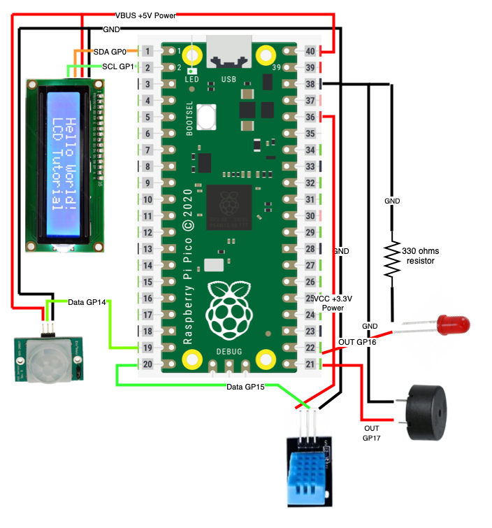

# Thermostat Sensor

This is my small DIY home project for creating a Thermostat Sensor using Raspberry Pi Pico and 
Micropython. The DHT11 device will sense the temperature and humidity of an indoor location and 
display it on the LCD.

## Requirements

- [Raspberry Pi Pico](https://www.raspberrypi.com/products/raspberry-pi-pico/)
- DHT11 Temperature Humidity sensor
- 16x2 I2C LCD
- Jumper cables with M-F connectors
- Breadboard

## Pin Diagram

## Running the application locally

Follow the pin diagram and complete the setup. After completing your setup connect your 
Raspberry Pi Pico to your laptop/computer using a USB-C cable and run the main.py program.

## Shutdown constantly running program

When you plugin your Raspberry Pi Pico to a power source main.py will start running. To stop 
this program from continuously running press the BOOTSEL button and plugin the USB-C so that the 
Raspberry Pi Pico appears as a drive. Now go to the drive and copy the flash_nuke.uf2 file to 
clear old contents.

[Flash Nuke UF2 File](https://datasheets.raspberrypi.com/soft/flash_nuke.uf2)

